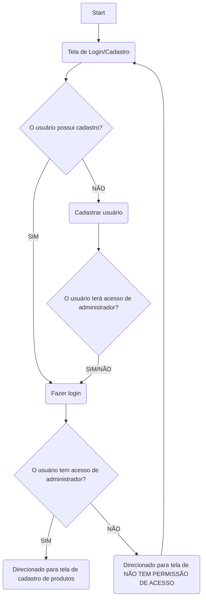

# LTD.2025.1.026-StocKing

# 📦 StocKing (Stock Kings)

## 📘 Documentação do Sistema

Este repositório contém a documentação completa do projeto desenvolvido pelos alunos do Centro Universitário Unimetrocamp como parte da disciplina **Programação Orientada a Objetos em Java**, sob orientação do professor **Kesede Rodrigues Julio**. O projeto adota a metodologia ágil **Scrum** e visa resolver problemas reais enfrentados por clientes parceiros.

---

## 📌 Visão Geral

O sistema foi desenvolvido a partir da necessidade que diversas empresas têm, relacionado a organização de estoque e almoxarifado.
Com o objetivo de auxiliar no controle de entradas e saídas, cadastro e identificação de produtos. A equipe propôs uma solução prática e intuitiva para esse problema, uma plataforma simples e prática, em que qualquer usuário pode facilmente se localizar e desenvolver suas tarefas.

---

## Sumário

- Dados do Cliente
- Equipe de Desenvolvimento
- Introdução
- Objetivo
- Escopo
- Backlogs do Produto
- Cronograma
- Materiais e Métodos
- Resultados
- Conclusão
- Homologação do MVP junto ao cliente
- Divulgação
- Carta de Apresentação
- Carta de Autorização
- Relato individual do processo

---

## 🧑‍💼 Dados do Cliente

- **Título do Projeto:** StocKing - Plataforma de Gerencimento de Estoque.
- **Cliente:** JR Control System
- **CNPJ/CPF:** 31.049.153/0001-57
- **Contato:** jonathas@jrcontrolsystem.com.br

---

## 👩‍💻 Equipe de Desenvolvimento

| Nome                        | Curso | Disciplina                              |
| --------------------------- | ----- | --------------------------------------- |
| Erick Valente Sprogis       | ADS   | Programação Orientada a Objetos em Java |
| Jhonatan Victor Conde Ramos | ADS   | Programação Orientada a Objetos em Java |
| Gustavo Henrique Ribeiro    | ADS   | Calouro Auxiliar                        |

**Professor Orientador:** Kesede Rodrigues Julio

---

## 🧭 Introdução

O projeto **StocKing** busca oferecer uma solução acessível para empresas com dificuldades em organizar seu estoque, almoxarifado. A proposta consiste em desenvolver um sistema que permita o controle organizacional de produtos, os que chegam, os que saem. Coordenar a etiquetagem de acordo e consecutivamente o cadastrar tudo no banco de dados, onde será feito o controle.

Desenvolvido com **Pyhton Flask** e **SQLAlchemy**, o sistema será simples e intuitivo, promovendo autonomia para seus usuários.

---

## 🎯 Objetivo

Criar uma plataforma digital que ajude os usuários a organizar:

- Controle de entradas e saídas.
- Cadastro e identificação de produtos.

---

## 🧩 Escopo

### Cadastro e Gestão de Produtos

- Cadastro de produtos (código, nome, descrição, categoria, preço, quantidade mínima e máxima).
- Atualização de estoque (entradas, saídas e ajustes).
- Consulta de produtos (filtros por nome, categoria e disponibilidade).
- Limite: Não incluir gestão de lotes ou validade (a menos que seja um requisito específico).

### Controle de Movimentações (Entradas e Saídas)

- Registro de compras (fornecedores, notas fiscais, data de entrada).
- Registro de vendas (saídas de estoque vinculadas a pedidos ou vendas).
- Relatórios básicos de movimentação (histórico por período).
- Limite: Não incluir integração com sistemas fiscais ou emissão de notas fiscais.

### Alertas e Indicadores Básicos

- Alertas de estoque baixo (quando atingir quantidade mínima).
- Relatório simples de produtos mais vendidos/em falta.
- Limite: Não incluir previsão de demanda ou análise avançada de estoque (machine learning, por exemplo).

### Fora do escopo (nesta etapa)

- Integração com ERP ou sistemas financeiros complexos.
- Controle de produção ou manufatura (para indústrias).
- Gestão de múltiplos armazéns ou filiais.
- Módulo de vendas ou e-commerce completo.

---

## 📋 Backlog do Produto

1. **Front-End**  
   HEADER: Simples e vazio, apenas nome da empresa.

   BODY: Barra de pesquisa de itens cadastrados (pesquisando por nome, código do produto ou outras atribuições). Bloco de tabelas mostrando histórico de itens cadastrados (corresponde à pesquisa realizada).

   FOOTER: Contato dos desenvolvedores, informações da faculdade e professor representante do projeto.

2. **Back-End**  
   Funcionamento do formulário para cadastrar os produtos organizadamente.
   ID, Nome, Código do produto, data de envio e expedição, e o tipo de serviço à ser realizado.

3. **Banco de Dados**  
   Armazenagem geral dos dados de cada produto cadastrado anteriormente.

4. **CRUD**  
   Interação do usuário com o sistema, Create (Criar), Read (Ler), Update (Atualizar) e Delete (Apagar).

---

## ⚙️ Tecnologias Utilizadas

- **HTML/CSS:** Interface web.
- **Python Flask:** Backend com as funcionalidades de formulários, requisições ao banco de dados e conexões entre páginas.
- **SQLAlchemy:** Biblioteca de interação para o Banco de dados.

---

## 🗓️ Cronograma (Sprint)

| Fase            | Início  | Término |
| --------------- | ------- | ------- |
| Sprint 1        | [26/02] | [19/03] |
| Sprint 2        | [19/03] | [09/04] |
| Sprint 3        | [09/04] | [23/04] |
| Sprint 4        | [23/04] | [21/05] |
| Sprint 5        | [21/05] | [11/06] |
| Desenvolvimento | [26/02] | [08/06] |

> _Datas devem ser preenchidas conforme planejamento no Jira._

---

## 📢 Divulgação

- **Repositório na Organization GitHub:** [\[LTD.2025.1.026-StocKing.git\]](https://github.com/unimetrocamp-startupclass/LTD.2025.1.026-StocKing.git)

---

## 🛠️ Materiais e Métodos

### Modelagem do Sistema:



## Tecnologias Utilizadas

- **HTML/CSS:** Interface web.
- **Python Flask:** Backend com as funcionalidades de formulários, requisições ao banco de dados e conexões entre páginas.
- **SQLAlchemy:** Biblioteca de interação para o Banco de dados.

---

## 7. 🔧 Resultados

### Protótipo:

#### Tela de Login


_Descrição: Esta tela permite que usuários existentes façam login no sistema._

#### Tela de Cadastro


_Descrição: Esta tela permite que novos usuários se cadastrem e então façam login no sistema._

#### Tela de Sem Permissão


_Descrição: Esta tela mostra ao usuário que foi cadastrado sem permissão de administrador, que ele não tem acesso ao sistema principal._

#### Tela de Cadastro de Produtos


_Descrição: Esta tela é onde os produtos são cadastrados._

#### Tela de Editar produto cadastrado


_Descrição: Esta tela é onde o usuário pode editar as informações de um produtos já cadastrado._

### Códigos das principais funcionalidades:

```python
# app.py
import os
from flask import Flask
from db import db
from routes import main as main_blueprint

def create_app():
    """
    Função que cria e configura a aplicação Flask (Application Factory).
    """
    app = Flask(__name__)

    # --- CONFIGURAÇÃO ---
    app.config['SECRET_KEY'] = 'uma-chave-secreta-muito-segura-e-dificil-de-adivinhar'
    basedir = os.path.abspath(os.path.dirname(__file__))
    db_path = os.path.join(basedir, 'instance', 'estoque.db')
    app.config['SQLALCHEMY_DATABASE_URI'] = 'sqlite:///' + db_path
    app.config['SQLALCHEMY_TRACK_MODIFICATIONS'] = False

    # --- INICIALIZAÇÃO DE EXTENSÕES ---
    db.init_app(app)

    # --- REGISTRO DE BLUEPRINTS ---
    app.register_blueprint(main_blueprint)

    # --- CRIAR BANCO DE DADOS ---
    with app.app_context():
        # --- LINHAS ADICIONADAS PARA CORRIGIR O ERRO ---
        # Garante que a pasta 'instance' exista antes de criar o DB
        instance_path = os.path.join(basedir, 'instance')
        if not os.path.exists(instance_path):
            os.makedirs(instance_path)
        # -------------------------------------------------

        db.create_all()

    return app

# --- EXECUÇÃO ---

if **name** == '**main**':
app = create_app()
app.run(debug=True, port=5000)
```

---

## 8. Conclusão

### Impacto do Sistema:

#### O sistema serviu de grande ajuda para manter a **organização** do estoque e almoxarifado mediante à grande quantidade de produtos e itens recebidos e enviados pela empresa toda a semana.

### Melhorias Futuras:

#### O cliente tem o desejo de incluir esse sistema de Gerenciamento de Estoque ao sistema que ele já possui dentro da empresa. Desejo que infelizmente ainda não pudemos atender, mas planejamos futuramente.

---

## 9. Homologação do MVP junto do cliente

#### Após as entregas parciais, realizadas de acordo com os requisitos do sistema e cronograma, o MVP foi apresentado em uma reunião, realizada entre o time de desenvolvedores e o cliente.

##### _(fotos e lista de participantes da homologação)_

---

## 10. Divulgação

### LinkedIn do Projeto:

[\[Artigo StocKing\]](https://www.linkedin.com/posts/erick-valente-sprogis-51662827b_activity-7328531152275660800-Um3_?utm_source=share&utm_medium=member_desktop&rcm=ACoAAERCEuIBEsjun9w_f2OroXQukals3qMvt48)

### Seminário de Projetos de Software

##### _(fotos e vídeo da apresentação)_

#### Segue abaixo a lista de presentes na apresentação.

##### _(Lista de presença da apresentação)_

### FENETEC: Feira de Negócios em Tecnologia

#### Apresentação do Projeto:

##### _(fotos e vídeo da apresentação)_

#### Segue abaixo a lista de presentes na FENETEC.

#### Lista de Presença - Quarta-Feira - 14/05/2025

| Nome do Aluno                    | RA           |
| :------------------------------- | :----------- |
| Gustavo Andrade Magalhães        | 202402799584 |
| Nicolas Anderson Cala            | 202402846401 |
| Sabrina Moreno Paes              | 202403733943 |
| Zahira de Oliveira Silva         | 202402893981 |
| Ademir Filho Pinho da Silva      | 202308428641 |
| Eduardo Alexandre da Rocha Filho | 202309148692 |
| Leonardo Henrique de Andrade     | 202309398303 |
| Lucas de Souza Lanaro            | 202308428497 |
| Ana Beatriz Cossari              | 202302480624 |
| Gabriel Nakamura Ramos           | 202302381286 |
| Kelton Bruno Santos de Oliveira  | 202302380883 |
| Luiz Alberto da Silva Junior     | 202302423108 |
| Gabriel Rodrigues Honorato       | 20240266029  |
| Isadora Geremias de Melo         | 202403503786 |
| Davi Miguel da Rocha Lima        | 202402530951 |
| Natan Henrique Ribeiro lobo      | 202402531221 |
| Nicolas Mansano Duarte           | 202403955423 |
| Victor Felipe Pires              | 202403000857 |
| Augusto Ramlow                   | 202308395815 |
| Wallace da Silva Francisco       | 202308428713 |
| Willian Luiz iamarino gandolphi  | 202308428454 |
| Erick Valente Sprogis            | 202403871751 |
| Jhonatan Victor Conde Ramos      | 202403718774 |

---

## 11. Carta de Aprensetação

```md
Vimos por meio desta apresentar o grupo de acadêmicos do Centro Universitário Unimetrocamp, localizada à Rua Sales de Oliveira, 1661 - Campinas - SP, a fim de convidá-lo a participar de uma atividade extensionista associada ao componente curricular **Programação Orientada a Obejtos em Java**, sob responsabilidade do orientador Prof. Kesede Rodrigues Julio (profkesede64@gmail.com).

Em consonância ao Plano Nacional de Educação vigente, o Centro Universitário Unimetrocamp promove o Desenvolvimento de Software que, norteados pela metodologia de Gerenciamento Ágil Scrum, tem por princípios fundantes o diagnóstico dos problemas/demandas/necessidades, a participação ativa dos interessados/públicos participantes, a construção dialógica, coletiva e experiencial de conhecimentos, o planejamento de ações, o desenvolvimento e avaliação das ações, a sistematização dos conhecimentos, a avaliação das ações desenvolvidas.

Nesse contexto, a disciplina acima mencionada tem como principal escopo os temas relacionados à Programação Orientada à Objeto / Padrões de Projetos de Software, no que diz respeito ao desenvolvimento de um software utilizando Programação Orientada à Objeto.

Sendo assim, pedimos o apoio de **JR Control System** para a realização das seguintes atividades: levantamento de requisitos, validação das entregas parciais, revalidação dos requisitos, homologação do MVP, ou qualquer outra intervenção que auxilie no desenvolvimento das competências de nossos acadêmicos e ao mesmo tempo possa contribuir para a comunidade em que estamos inseridos.

Aproveitamos a oportunidade para solicitarmos, em caso de aceite, que a parceria seja formalizada, mediante assinatura da Carta de Autorização, as atividades e informações que o(s) aluno(s) poderá(ão) ter acesso.

Em tempo, registramos ainda, o convite para a participação de todos os interessados no fórum semestral de acompanhamento e avaliação das atividades realizadas, que está previsto para o final deste semestre, e será comunicado previamente em convite específico.

Desde já nos colocamos à sua disposição para quaisquer esclarecimentos.

Atenciosamente,

Campinas, _(dia)_ de _(mês)_ de 202 _(ano)_ .

---

Assinatura Direção Acadêmica da IES

---

Assinatura Docente
```

---

## Carta de Autorização

```md
Eu, (preencher com nome do responsável), (preencher com cargo ocupado), da (nome da empresa, organização, associação, escola, secretaria, etc., situada no endereço – inserir o endereço), autorizo a realização das seguintes atividades acadêmicas do componente extensionista <código e nome da disciplina>, do Centro Universitário Unimetrocamp, sob orientação do Prof. Kesede Rodrigues Julio.

Atividades:

levantamento de requisitos, validação das entregas parciais, revalidação dos requisitos, homologação do MVP, ou qualquer outra intervenção que auxilie no desenvolvimento das competências de nossos acadêmicos e ao mesmo tempo possa contribuir para a comunidade em que estamos inseridos.

Conforme combinado em contato prévio, as atividades acima descritas são autorizadas para os seguintes alunos:

| Nome                        | Curso | Matrícula    |
| --------------------------- | ----- | ------------ |
| Erick Valente Sprogis       | ADS   | 202403871751 |
| Jhonatan Victor Conde Ramos | ADS   | 202403718774 |
| Gustavo Henrique Ribeiro    | ADS   | 202503103011 |

Declaro que fui informado por meio da Carta de Apresentação sobre as características e objetivos das atividades que serão realizadas na organização/instituição/empresa a qual represento e afirmo estar ciente de tratar-se de uma atividade realizada com intuito exclusivo de ensino de alunos de graduação, sem a finalidade de exercício profissional.

Desta forma, autorizo, em caráter de confidencialidade:

- o acesso a informações e dados que forem necessários à execução da atividade;
- o registro de imagem por meio de fotografias;
- outro: (especificar)

Campinas, _(dia)_ de _(mês)_ de 202 _(ano)_ .

---

_(Assinatura, nome completo do responsável, email de contato e com carimbo da empresa)_
```

---

## 13. Relato indovidual do processo

- Erick Valente Sprogis:

  _Fui responsável pela interface e pela experiência do usuário (UX). Estruturei todos os templates HTML, desde a página de login até o dashboard principal de produtos, utilizando o framework Bootstrap para criar um design limpo e responsivo. Também adicionei interatividade com JavaScript, como a função de 'mostrar/esconder senha', para melhorar a usabilidade. Meu trabalho foi garantir que a aplicação não só funcionasse, mas que fosse visualmente agradável e intuitiva, conectando o visual com os dados vindos do backend através do Jinja2._

- Jhonatam Victor Conde Ramos:

  _No projeto, foquei na construção do backend e do banco de dados. Fui responsável por desenhar a estrutura das tabelas de usuários e produtos e por implementar os modelos com SQLAlchemy. Programei toda a lógica de servidor em Flask, incluindo o sistema de login seguro com permissões de administrador e as funcionalidades para cadastrar, editar e excluir produtos. Essencialmente, construí o motor que faz toda a aplicação funcionar, garantindo que os dados fossem gerenciados de forma segura e eficiente no lado do servidor._

- Gustavo Henrique Ribeiro:

  _Minha contribuição focou na gestão, documentação e análise de dados do projeto. Iniciei configurando nosso repositório no GitHub, incluindo um .gitignore para manter o projeto limpo, e escrevi a documentação principal no README.md. Após a aplicação estar funcional, executei o script de análise (analise.py) para extrair informações do banco. Utilizando Pandas e Matplotlib, gerei os gráficos e tabelas que formaram a base da nossa apresentação final, transformando os dados brutos do sistema em insights visuais._

---

## 🧾 Observações Finais

- ⚠️ As instruções internas foram removidas conforme orientação.
- 🔗 Este `README.md` deve ser compartilhado via link raw com o orientador.
- 📅 Todas as entregas devem respeitar o cronograma oficial definido pela disciplina.

---

> _Projeto acadêmico desenvolvido com fins educativos. Todos os dados são fictícios e utilizados para simulação de um ambiente real de desenvolvimento de software._
