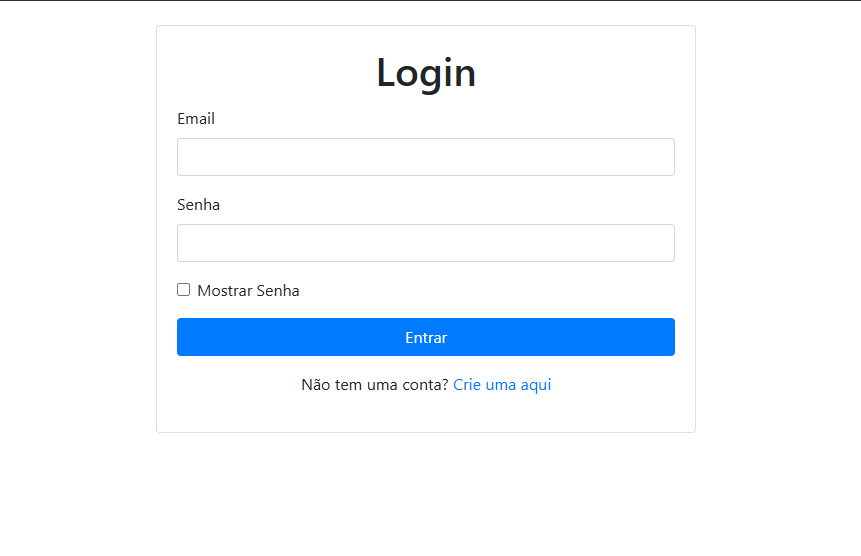
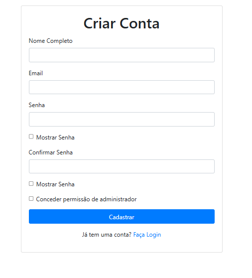
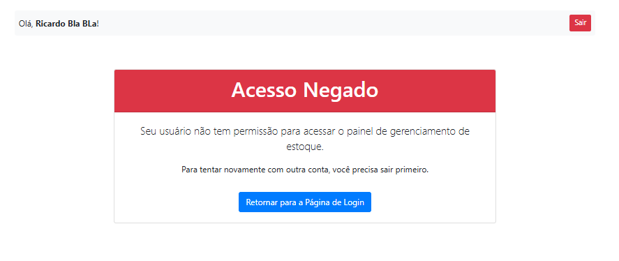
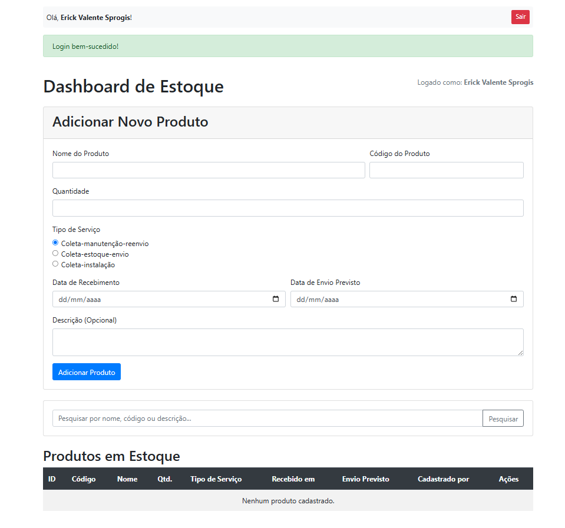
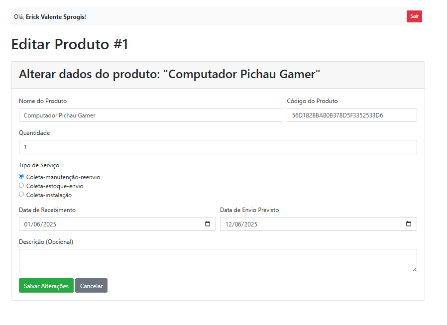

# LTD.2025.1.026-StocKing

# 📦 StocKing (Stock Kings)

## 📘 Documentação do Sistema

Este repositório contém a documentação completa do projeto desenvolvido pelos alunos do Centro Universitário Unimetrocamp como parte da disciplina **Programação Orientada a Objetos em Java**, sob orientação do professor **Kesede Rodrigues Julio**. O projeto adota a metodologia ágil **Scrum** e visa resolver problemas reais enfrentados por clientes parceiros.

---

## 📌 Visão Geral

O sistema foi desenvolvido a partir da necessidade que diversas empresas têm, relacionado a organização de estoque e almoxarifado.
Com o objetivo de auxiliar no controle de entradas e saídas, cadastro e identificação de produtos. A equipe propôs uma solução prática e intuitiva para esse problema, uma plataforma simples e prática, em que qualquer usuário pode facilmente se localizar e desenvolver suas tarefas.

---

## Sumário

- Dados do Cliente
- Equipe de Desenvolvimento
- Introdução
- Objetivo
- Escopo
- Backlogs do Produto
- Cronograma
- Materiais e Métodos
- Resultados
- Conclusão
- Homologação do MVP junto ao cliente
- Divulgação
- Carta de Apresentação
- Carta de Autorização
- Relato individual do processo

---

## 🧑‍💼 Dados do Cliente

- **Título do Projeto:** StocKing - Plataforma de Gerencimento de Estoque.
- **Cliente:** JR Control System
- **CNPJ/CPF:** 31.049.153/0001-57
- **Contato:** jonathas@jrcontrolsystem.com.br

---

## 👩‍💻 Equipe de Desenvolvimento

| Nome                        | Curso | Disciplina                              |
| --------------------------- | ----- | --------------------------------------- |
| Erick Valente Sprogis       | ADS   | Programação Orientada a Objetos em Java |
| Jhonatan Victor Conde Ramos | ADS   | Programação Orientada a Objetos em Java |
| Gustavo Henrique Ribeiro    | ADS   | Calouro Auxiliar                        |

**Professor Orientador:** Kesede Rodrigues Julio

---

## 🧭 Introdução

O projeto **StocKing** busca oferecer uma solução acessível para empresas com dificuldades em organizar seu estoque, almoxarifado. A proposta consiste em desenvolver um sistema que permita o controle organizacional de produtos, os que chegam, os que saem. Coordenar a etiquetagem de acordo e consecutivamente o cadastrar tudo no banco de dados, onde será feito o controle.

Desenvolvido com **Pyhton Flask** e **SQLAlchemy**, o sistema será simples e intuitivo, promovendo autonomia para seus usuários.

---

## 🎯 Objetivo

Criar uma plataforma digital que ajude os usuários a organizar:

- Controle de entradas e saídas.
- Cadastro e identificação de produtos.

---

## 🧩 Escopo

### Cadastro e Gestão de Produtos

- Cadastro de produtos (código, nome, descrição, categoria, preço, quantidade mínima e máxima).
- Atualização de estoque (entradas, saídas e ajustes).
- Consulta de produtos (filtros por nome, categoria e disponibilidade).
- Limite: Não incluir gestão de lotes ou validade (a menos que seja um requisito específico).

### Controle de Movimentações (Entradas e Saídas)

- Registro de compras (fornecedores, notas fiscais, data de entrada).
- Registro de vendas (saídas de estoque vinculadas a pedidos ou vendas).
- Relatórios básicos de movimentação (histórico por período).
- Limite: Não incluir integração com sistemas fiscais ou emissão de notas fiscais.

### Alertas e Indicadores Básicos

- Alertas de estoque baixo (quando atingir quantidade mínima).
- Relatório simples de produtos mais vendidos/em falta.
- Limite: Não incluir previsão de demanda ou análise avançada de estoque (machine learning, por exemplo).

### Fora do escopo (nesta etapa)

- Integração com ERP ou sistemas financeiros complexos.
- Controle de produção ou manufatura (para indústrias).
- Gestão de múltiplos armazéns ou filiais.
- Módulo de vendas ou e-commerce completo.

---

## 📋 Backlog do Produto

1. **Front-End**  
   HEADER: Simples e vazio, apenas nome da empresa.

   BODY: Barra de pesquisa de itens cadastrados (pesquisando por nome, código do produto ou outras atribuições). Bloco de tabelas mostrando histórico de itens cadastrados (corresponde à pesquisa realizada).

   FOOTER: Contato dos desenvolvedores, informações da faculdade e professor representante do projeto.

2. **Back-End**  
   Funcionamento do formulário para cadastrar os produtos organizadamente.
   ID, Nome, Código do produto, data de envio e expedição, e o tipo de serviço à ser realizado.

3. **Banco de Dados**  
   Armazenagem geral dos dados de cada produto cadastrado anteriormente.

4. **CRUD**  
   Interação do usuário com o sistema, Create (Criar), Read (Ler), Update (Atualizar) e Delete (Apagar).

---

## ⚙️ Tecnologias Utilizadas

- **HTML/CSS:** Interface web.
- **Python Flask:** Backend com as funcionalidades de formulários, requisições ao banco de dados e conexões entre páginas.
- **SQLAlchemy:** Biblioteca de interação para o Banco de dados.

---

## 🗓️ Cronograma (Sprint)

| Fase            | Início  | Término |
| --------------- | ------- | ------- |
| Sprint 1        | [26/02] | [19/03] |
| Sprint 2        | [19/03] | [09/04] |
| Sprint 3        | [09/04] | [23/04] |
| Sprint 4        | [23/04] | [21/05] |
| Sprint 5        | [21/05] | [11/06] |
| Desenvolvimento | [26/02] | [08/06] |

> _Datas devem ser preenchidas conforme planejamento no Jira._

---

## 📢 Divulgação

- **Repositório na Organization GitHub:** [\[LTD.2025.1.026-StocKing.git\]](https://github.com/unimetrocamp-startupclass/LTD.2025.1.026-StocKing.git)

---

## 🛠️ Materiais e Métodos

### Modelagem do Sistema:

````mermaid
graph TD
    A[Start] --> B(Tela de Login/Cadastro)
    B --> C{O usuário possui cadastro?}

    C -- SIM --> D(Fazer login)
    C -- NÃO --> E(Cadastrar usuário)

    E --> F{O usuário terá acesso de administrador?}
    F -- SIM/NÃO --> D

    D --> G{O usuário tem acesso de administrador?}
    G -- SIM --> H(Direcionado para tela de cadastro de produtos)
    G -- NÃO --> I(Direcionado para tela de NÃO TEM PERMISSÃO DE ACESSO)

    I --> B

```

## Tecnologias Utilizadas

- **HTML/CSS:** Interface web.
- **Python Flask:** Backend com as funcionalidades de formulários, requisições ao banco de dados e conexões entre páginas.
- **SQLAlchemy:** Biblioteca de interação para o Banco de dados.

---

## 🔧 Resultados

### Protótipo:

#### Tela de Login


*Descrição: Esta tela permite que usuários existentes façam login no sistema.*

#### Tela de Cadastro


*Descrição: Esta tela permite que novos usuários se cadastrem e então façam login no sistema.*

#### Tela de Sem Permissão


*Descrição: Esta tela mostra ao usuário que foi cadastrado sem permissão de administrador, que ele não tem acesso ao sistema principal.*

#### Tela de Cadastro de Produtos


*Descrição: Esta tela é onde os produtos são cadastrados.*

#### Tela de Editar produto cadastrado


*Descrição: Esta tela é onde o usuário pode editar as informações de um produtos já cadastrado.*

### Códigos das principais funcionalidades:

```python
# app.py

# app.py
import os
from flask import Flask
from db import db
from routes import main as main_blueprint

def create_app():
    """
    Função que cria e configura a aplicação Flask (Application Factory).
    """
    app = Flask(__name__)

    # --- CONFIGURAÇÃO ---
    app.config['SECRET_KEY'] = 'uma-chave-secreta-muito-segura-e-dificil-de-adivinhar'
    basedir = os.path.abspath(os.path.dirname(__file__))
    db_path = os.path.join(basedir, 'instance', 'estoque.db')
    app.config['SQLALCHEMY_DATABASE_URI'] = 'sqlite:///' + db_path
    app.config['SQLALCHEMY_TRACK_MODIFICATIONS'] = False

    # --- INICIALIZAÇÃO DE EXTENSÕES ---
    db.init_app(app)

    # --- REGISTRO DE BLUEPRINTS ---
    app.register_blueprint(main_blueprint)

    # --- CRIAR BANCO DE DADOS ---
    with app.app_context():
        # --- LINHAS ADICIONADAS PARA CORRIGIR O ERRO ---
        # Garante que a pasta 'instance' exista antes de criar o DB
        instance_path = os.path.join(basedir, 'instance')
        if not os.path.exists(instance_path):
            os.makedirs(instance_path)
        # -------------------------------------------------

        db.create_all()

    return app

```

# --- EXECUÇÃO ---
if __name__ == '__main__':
    app = create_app()
    app.run(debug=True, port=5000)

---

## 🧾 Observações Finais

- ⚠️ As instruções internas foram removidas conforme orientação.
- 🔗 Este `README.md` deve ser compartilhado via link raw com o orientador.
- 📅 Todas as entregas devem respeitar o cronograma oficial definido pela disciplina.

---

> _Projeto acadêmico desenvolvido com fins educativos. Todos os dados são fictícios e utilizados para simulação de um ambiente real de desenvolvimento de software._
````
